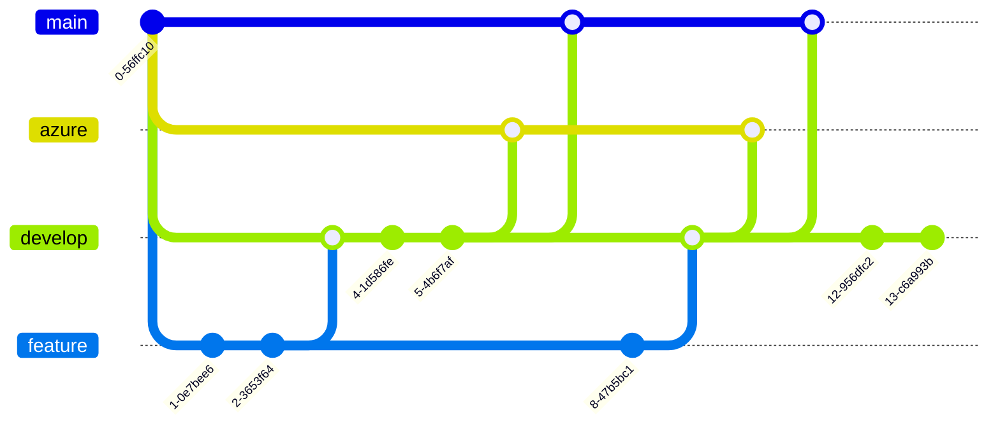

# ApiDotNet

## Lancer le projet en local

- Démarrer tous les services :

    ```shell
    docker-compose up -d
    ```
- Initialiser la BDD MySql :
    ```shell
    cd ApiDotNet
    dotnet ef database update
    ```

La base de données est prête à être utilisée !

## Gitflow



### Branches

- **main** : Déploie sur le serveur linux

- **azure** : Déploie sur le cloud Azure

- **develop** : Branche de développement

- **feature** : Développement d'une feature

## Rôles

Par défaut, on retrouve les rôles :
- Défault
- Developer
- Admin

