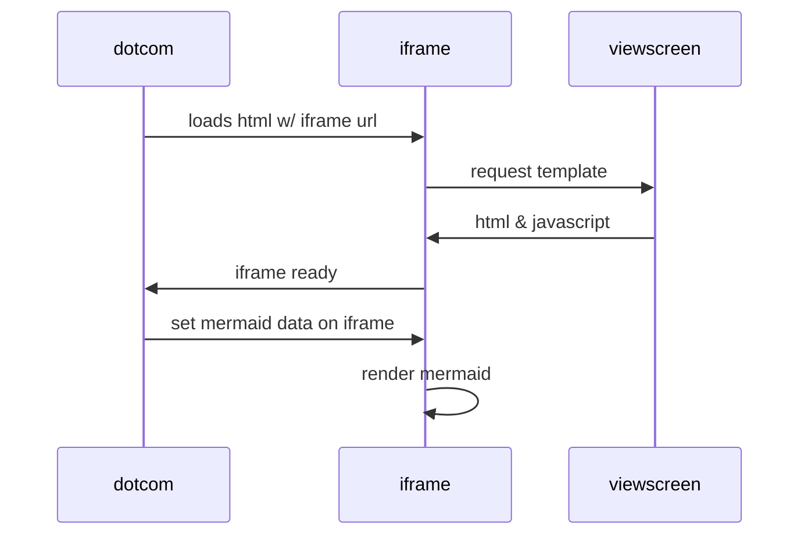

# ApiDotNet

## Lancer le projet

- Démarrer tous les services :

    ```shell
    docker-compose up -d
    ```
- Initialiser la BDD MySql :
    ```shell
    cd ApiDotNet
    dotnet ef migrations add initialMigration
    dotnet ef database update
    ```
- Créer un user ayant le rôle administrateur
  Récupérer l'id du rôle "Administrateur" dans la table

La base de données est prête à être utilisée !

## Gitflow


